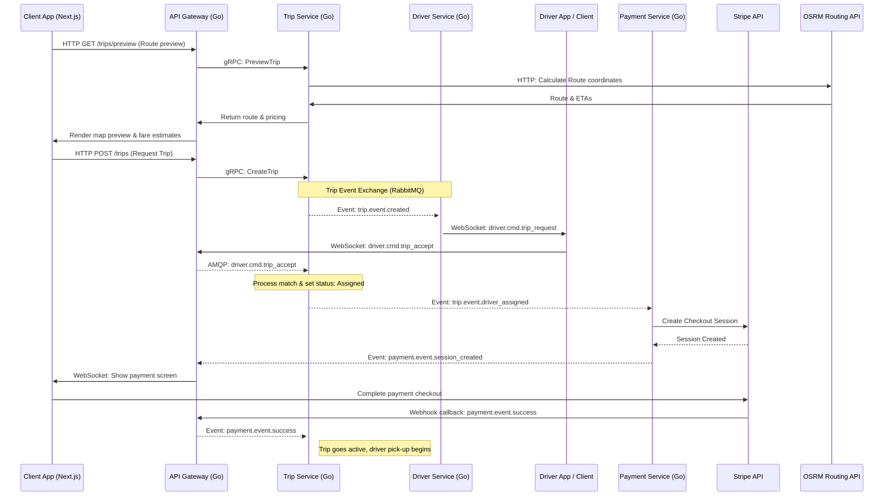
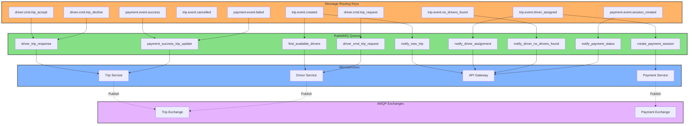

# 🚗 SafeDriveEt (SafeDrive Ethiopia)

SafeDriveEt is a state-of-the-art, event-driven microservices ride-hailing and taxi platform tailored for the Ethiopian market. It is engineered for low-latency driver matching, resilient asynchronous payments, and real-time WebSocket communication.

Built using **Go (Golang)**, **Next.js**, **RabbitMQ**, **Docker**, and orchestration on **Kubernetes (Tilt & GKE)**.

---

## 🏗️ System Architecture & Event Flow

SafeDriveEt uses an **asynchronous event-driven choreography** pattern powered by RabbitMQ. This ensures high availability, decouples heavy computations (like routing and payment processing) from the main client flow, and ensures fault-tolerant operations.

### 1. Trip Booking & Lifecycle Flow
Below is the sequence diagram illustrating how a user requests a ride, gets matched with a driver, and pays securely:



### 2. RabbitMQ Message Distribution
The system uses dedicated AMQP Exchanges and routing keys to distribute events to respective consumer queues:



---

## 🗂️ Project Structure

- **`/services`**: Microservice implementations.
  - **`api-gateway/`**: Built in Go; acts as the primary proxy. Translates external HTTP/WebSocket clients' requests into internal gRPC calls and AMQP messages.
  - **`trip-service/`**: Built in Go; encapsulates trip logic, route parsing, and pricing schemes.
  - **`driver-service/`**: Built in Go; maintains driver status (availability, geohash locations) and executes the matching logic.
  - **`payment-service/`**: Built in Go; coordinates Stripe checkout, Chapa integration, and tracks payment events.
- **`/web`**: Web app client dashboard powered by Next.js, React, TailwindCSS, and shadcn/ui.
- **`/shared`**: Standard Go modules reused across all microservices (DB wrappers, env parsers, contract schemas, utilities).
- **`/infra`**: Kubernetes templates and Dockerfiles.
  - `infra/development/`: Manifests, Tiltfile configuration, and Dockerfiles optimized for fast hot-reload during local dev.
  - `infra/production/`: Hardened manifests and multi-stage Dockerfiles prepared for GKE deployment.

---

## 🚀 Local Development Setup

To run SafeDriveEt locally, you will need a Kubernetes cluster and Tilt, which manages live-reloading of microservices within your cluster.


### Step-by-Step Installation

#### 1. Setup local Kubernetes Cluster (e.g., Minikube)
Start minikube and enable the ingress controller:
```bash
minikube start --driver=docker
minikube addons enable ingress
```

#### 2. Install Go Dependencies
Ensure the shared modules and dependencies are clean:
```bash
go mod tidy
```

#### 3. Run with Tilt
Launch the Tilt dashboard to build, deploy, and monitor the microservices automatically:
```bash
tilt up
```
Once Tilt is running, press **`Space`** or open [http://localhost:10350](http://localhost:10350) in your browser to access the Tilt UI. It compiles the Go binaries, builds Docker images, deploys K8s resources, and streams live logs.

- **API Gateway** is forwarded on `http://localhost:8081`
- **Next.js Web Frontend** is accessible at `http://localhost:3000`

---

## 🔍 Monitoring & Logging

### View Cluster Pods
```bash
kubectl get pods -A
```

### Access Kubernetes Dashboard
```bash
minikube dashboard
```

### Distributed Tracing (Jaeger)
If Jaeger tracing is enabled in the development namespace, you can access the tracing UI to analyze network flows and latency:
```bash
kubectl port-forward deployment/jaeger 16686:16686
# Open http://localhost:16686
```

---

